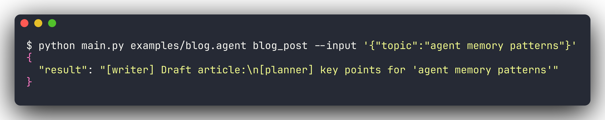
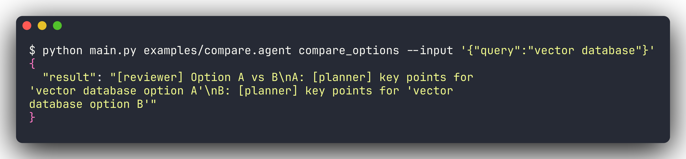
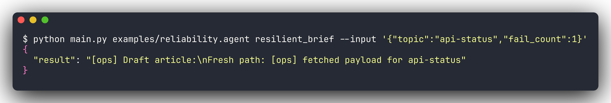
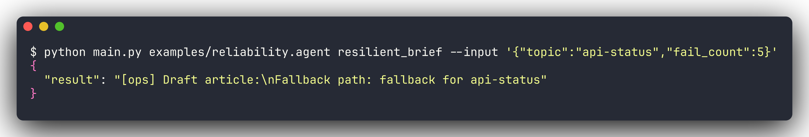
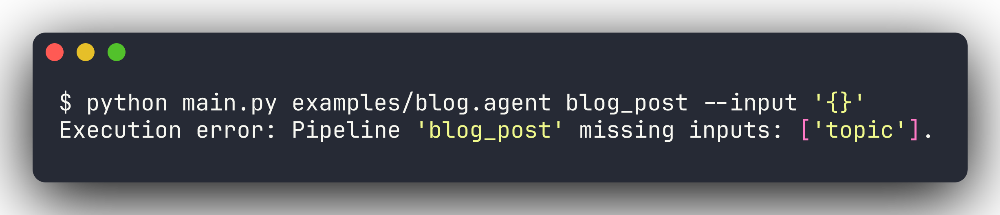

# AgentLang

A tiny, self-contained DSL for agentic workflows. Define agents, typed tasks, and pipelines — run them with deterministic mock adapters or live OpenAI backends.

```agentlang
agent planner {
  model: "gpt-4.1"
  , tools: [web_search]
}

task research(topic: String) -> Obj{notes: String} {}
task draft(notes: String)    -> Obj{article: String} {}

pipeline blog_post(topic: String) -> String {
  let r = run research with { topic: topic } by planner;
  let d = run draft    with { notes: r.notes } by planner;
  return d.article;
}
```



---

## Features

- **Static type checker** — catches bad arguments, wrong field access, and return type mismatches before execution
- **Parallel execution** — `parallel { } join` runs tasks concurrently via `ThreadPoolExecutor`
- **Retry & fallback** — `retries N on_fail use <expr>` as first-class syntax
- **Two adapter modes** — `mock` (deterministic, no API key) and `live` (OpenAI + web search)
- **No framework dependencies** — lexer, parser, checker, and runtime are all pure Python

---

## Examples

### Parallel comparison

Two research tasks run concurrently, results merged for a downstream compare step.



### Retry with fallback

`fail_count: 1` — succeeds within the retry budget:



`fail_count: 5` — exhausts retries, uses fallback value:



### Input validation

Strict validation before execution runs:



---

## Quick start

```bash
# mock mode — no API key needed
python main.py examples/blog.agent blog_post --input '{"topic":"agent memory patterns"}'
python main.py examples/compare.agent compare_options --input '{"query":"vector database"}'
python main.py examples/support.agent support_reply --input '{"message":"urgent refund request"}'
python main.py examples/reliability.agent resilient_brief --input '{"topic":"api-status","fail_count":1}'
python main.py examples/reliability.agent resilient_brief --input '{"topic":"api-status","fail_count":5}'

# live mode — requires OPENAI_API_KEY
export OPENAI_API_KEY="..."
python main.py examples/blog.agent blog_post --adapter live --input '{"topic":"agent memory patterns"}'
```

---

## Project layout

```text
agentlang/
  ast.py        -- AST node dataclasses
  lexer.py      -- tokenizer + string decoder
  parser.py     -- recursive-descent parser
  checker.py    -- static type checker
  runtime.py    -- pipeline executor
  stdlib.py     -- built-in task handlers
  adapters/     -- OpenAI + tool adapters
examples/       -- five runnable .agent programs
docs/           -- full documentation (MkDocs)
main.py         -- CLI entrypoint
```

## Documentation

Full docs at **https://nanamanu.com/agl**

Covers: [Quick Start](docs/tutorial/quickstart.md) · [Language Reference](docs/reference/language.md) · [Adapters](docs/reference/adapters.md) · [Formal Semantics](docs/advanced/semantics.md) · [Contributing](docs/contributing.md)
