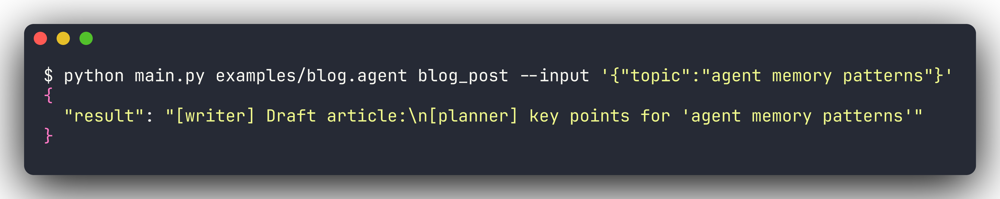
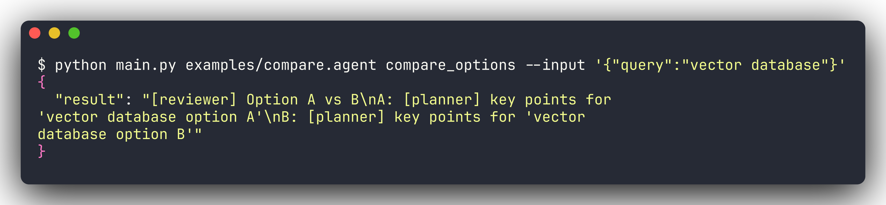
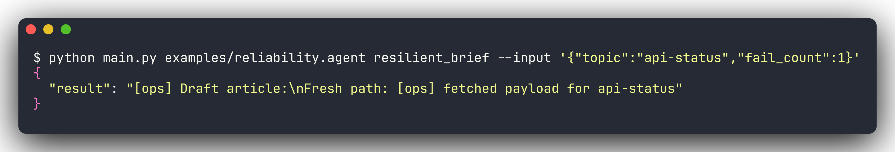
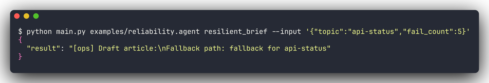
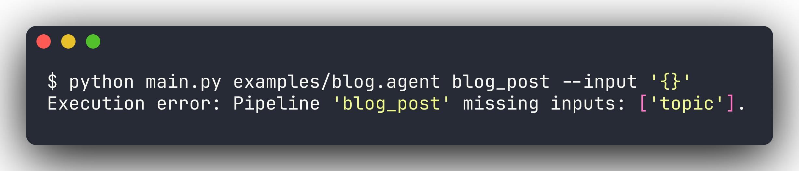

# AgentLang

A tiny, self-contained DSL for agentic workflows. Define agents, typed tasks, declarative workflows, and low-level pipelines. The primary implementation is now a native Rust library and CLI; the original Python implementation remains as a compatibility oracle and currently provides the live model adapters.

```agentlang
tool web_search(query: String) -> List[Obj{title: String, url: String, snippet: String}] {}

agent researcher {
  model: "gpt-4.1"
  , tools: [web_search]
}

agent reviewer {
  model: "gpt-4.1-mini"
  , tools: [web_search]
}

agent writer {
  model: "gpt-4.1-mini"
  , tools: []
}

task draft_outline(topic: String) -> Obj{outline: String, sources: List[String]} by agent {}
task review_approved_outline(topic: String, outline: String, sources: List[String]) -> Obj{approved: Bool, feedback: String} by agent {}
task revise_outline(topic: String, outline: String, sources: List[String], feedback: String) -> Obj{outline: String, sources: List[String]} by agent {}
task write_post(topic: String, outline: String) -> Obj{article: String} by agent {}

workflow blog_post(topic: String) -> String {
  stage draft = researcher does draft_outline(topic);
  review approved_outline = reviewer checks draft revise with researcher using revise_outline max_rounds 2;
  stage post = writer does write_post(topic, approved_outline.outline);
  return post.article;
}
```



---

## Features

- **Static type checker** — catches bad arguments, wrong field access, and return type mismatches before execution
- **Type aliases & enums** — `type Notes = Obj{...};` and `enum Tone { formal, casual };` for cleaner signatures
- **Declarative workflows** — `workflow`, `stage`, and `review` compile into explicit pipeline IR
- **Parallel execution** — `parallel { } join` with optional per-block `max_concurrency`
- **Shorthand syntax** — `let r = task(args) by agent;` as concise alternative to `run ... with`
- **Loop control** — `while`, `break`, and `continue` are available in lowered pipelines and low-level authoring
- **Retry & fallback** — `retries N on_fail use <expr>` as first-class syntax
- **Try/catch** — `try { ... } catch err { ... }` for multi-step error recovery
- **Pipeline composition** — pipelines can call other pipelines with `run sub_pipeline with {...}`
- **Assert & test blocks** — `assert expr, "msg";` and `test "name" { ... }` for in-language testing
- **Typed agent tasks** — `task ... by agent {}` enforces declared output shapes at runtime; `model` is optional
- **Embeddable handler registry** — Rust applications register native task handlers through the public `Registry` API
- **Observability** — `--output-trace` writes structured JSON execution traces
- **Native live adapters** — OpenAI Responses and Anthropic Messages clients with validated web-tool calling
- **Plugin migration bridge** — existing Python task plugins continue to work through `--plugin`
- **Small dependency surface** — the Rust core uses `serde`, `serde_json`, `thiserror`, and `clap`

---

## Examples

### Parallel comparison

Two research tasks run concurrently, results merged for a downstream compare step.



### Retry with fallback

`fail_count: 1` — succeeds within the retry budget:



`fail_count: 5` — exhausts retries, uses fallback value:



### Input validation

Strict validation before execution runs:



---

## Quick start

```bash
# build and test the native implementation
cargo build --release
cargo test
cargo install --path .

# deterministic mock mode — no API key needed
cargo run -- examples/blog.agent blog_post --input '{"topic":"agent memory patterns"}'
cargo run -- examples/compare.agent compare_options --input '{"query":"vector database"}'
cargo run -- examples/support.agent support_reply --input '{"message":"urgent refund request"}'
cargo run -- examples/reliability.agent resilient_brief --input '{"topic":"api-status","fail_count":1}'

# parse and statically check without running
cargo run -- examples/showcase_all_features.agent --check

# run test blocks
cargo run -- examples/showcase_all_features.agent --test

# write execution trace
cargo run -- examples/blog.agent blog_post --input '{"topic":"AI safety"}' --output-trace trace.json

# native live mode — requires the provider API key
export OPENAI_API_KEY="..."
cargo run -- examples/incident_runbook.agent respond_to_incident --adapter openai --trace-live --input '{"incident":"database failover drill"}'

# Anthropic and existing Python task plugins
export ANTHROPIC_API_KEY="..."
cargo run -- examples/multiagent_blog.agent publish_topic_blog --adapter anthropic --input '{"topic":"agent memory"}'
cargo run -- examples/showcase_all_features.agent --test --plugin examples/showcase_plugin.py

# interactive session and workflow lowering
cargo run -- repl
cargo run -- examples/newsletter.agent weekly_newsletter --lower
```

See [Rust port status](docs/rust-port.md) for the parity matrix and migration notes.

---

## Project layout

```text
src/
  ast.rs        -- typed Rust AST
  lexer.rs      -- tokenizer + string decoder
  parser.rs     -- parser, shorthand resolution, workflow lowering
  checker.rs    -- static type checker
  runtime.rs    -- concurrent pipeline executor + native Registry
  stdlib.rs     -- deterministic task handlers
  context.rs    -- structured execution traces
  adapters/     -- OpenAI, Anthropic, and validated web tools
  formatter.rs  -- lowered pipeline IR formatter
  plugins.rs    -- Python task/tool-plugin migration bridge
  lib.rs        -- public embedding API
  main.rs       -- native CLI
agentlang/
  ...           -- original Python reference implementation and live adapters
examples/       -- seventeen runnable .agent programs
docs/           -- full documentation (MkDocs)
main.py         -- compatibility Python CLI
```

## Documentation

Full docs at **https://nanamanu.com/agl**

Covers: [Quick Start](docs/tutorial/quickstart.md) · [Language Reference](docs/reference/language.md) · [Adapters](docs/reference/adapters.md) · [Formal Semantics](docs/advanced/semantics.md) · [Contributing](docs/contributing.md)
